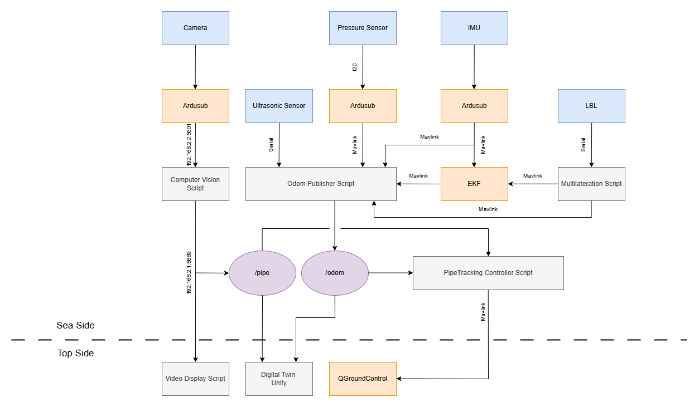

### Overview

This is the GitHub repository for the Mantaray BlueROV2 subsea vehicle developed as a bachelor project. 

The repository contains the ROV's code, numerous other utility scripts and a collection of different testing scripts and code snapshots.

### Repository Structure

The repository is comprised of three main folders:
- **operations**: This folder contains all the relevant sea-side code used for missions.
- **utils**: This folder contains numerous utility scripts that can be useful outside of operation activity, such as for post-mission analysis or development.
- **testing**: This folder contains old code utilized during testing and development of the different systems. It also contains some example logfiles and images which can be used for testing utility code.

### System Architecture

